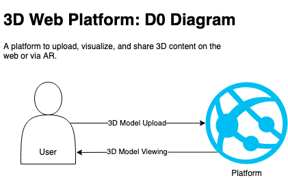
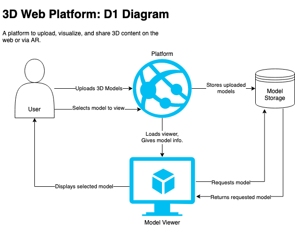
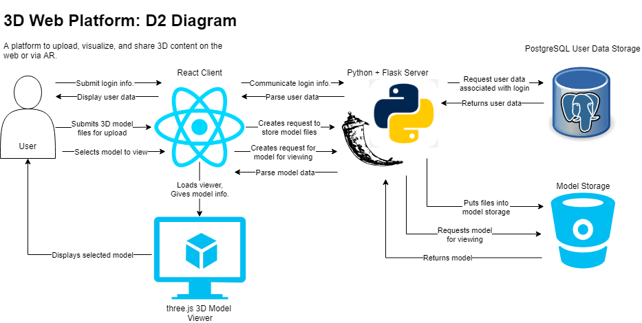

[README.md](../README.md) > Design-Diagrams.md

# Design Diagrams

## Diagram 0

D0: Highest level view of your project identifying basic input and output to the system.

## Diagram 1

D1: Elaborate design of several modules or subsystems given in D0.

## Diagram 2

D2: Further elaboration on D1, giving the most details concerning your system.

