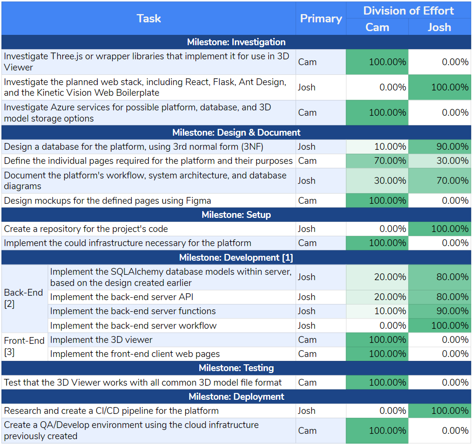

[README.md](../README.md) > Task-Effort-Matrix.md

# Task Effort Matrix

## Table in Google Sheets

-----

## Transcribed HTML Table

<table>
    <tr>
        <td colspan="2" rowspan="2">Task</td>
        <td rowspan="2">Primary Assignee</td>
        <td colspan="2">Division of Effort</td>
    </tr>
    <tr>
        <td>Cam</td>
        <td>Josh</td>
    </tr>
    <tr>
        <td colspan="5">Milestone: Investigation</td>
    </tr>
    <tr>
        <td colspan="2">Investigate Three.js or wrapper libraries that implement it for use in 3D Viewer</td>
        <td>Cam</td>
        <td>100.00%</td>
        <td>0.00%</td>
    </tr>
    <tr>
        <td colspan="2">Investigate the planned web stack, including React, Flask, Ant Design, and the Kinetic Vision Web Boilerplate</td>
        <td>Josh</td>
        <td>0.00%</td>
        <td>100.00%</td>
    </tr>
    <tr>
        <td colspan="2">Investigate Azure services for possible platform, database, and 3D model storage options</td>
        <td>Cam</td>
        <td>100.00%</td>
        <td>0.00%</td>
    </tr>
    <tr>
        <td colspan="5">Milestone: Design &amp; Document</td>
    </tr>
    <tr>
        <td colspan="2">Design a database for the platform, using 3rd normal form (3NF)</td>
        <td>Josh</td>
        <td>10.00%</td>
        <td>90.00%</td>
    </tr>
    <tr>
        <td colspan="2">Define the individual pages required for the platform and their purposes</td>
        <td>Cam</td>
        <td>70.00%</td>
        <td>30.00%</td>
    </tr>
    <tr>
        <td colspan="2">Document the platform's workflow, system architecture, and database diagrams</td>
        <td>Josh</td>
        <td>30.00%</td>
        <td>70.00%</td>
    </tr>
    <tr>
        <td colspan="2">Design mockups for the defined pages using Figma</td>
        <td>Cam</td>
        <td>100.00%</td>
        <td>0.00%</td>
    </tr>
    <tr>
        <td colspan="5">Milestone: Setup</td>
    </tr>
    <tr>
        <td colspan="2">Create a repository for the project's code</td>
        <td>Josh</td>
        <td>0.00%</td>
        <td>100.00%</td>
    </tr>
    <tr>
        <td colspan="2">Implement the could infrastructure necessary for the platform</td>
        <td>Cam</td>
        <td>100.00%</td>
        <td>0.00%</td>
    </tr>
    <tr>
        <td colspan="5">Milestone: Development</td>
    </tr>
    <tr>
        <td rowspan="4">Back-End</td>
        <td>Implement the SQLAlchemy database models within server, based on the design created earlier</td>
        <td>Josh</td>
        <td>20.00%</td>
        <td>80.00%</td>
    </tr>
    <tr>
        <td>Implement the back-end server API</td>
        <td>Josh</td>
        <td>20.00%</td>
        <td>80.00%</td>
    </tr>
    <tr>
        <td>Implement the back-end server functions</td>
        <td>Josh</td>
        <td>10.00%</td>
        <td>90.00%</td>
    </tr>
    <tr>
        <td>Implement the back-end server workflow</td>
        <td>Josh</td>
        <td>0.00%</td>
        <td>100.00%</td>
    </tr>
    <tr>
        <td rowspan="2">Front-End</td>
        <td>Implement the 3D viewer</td>
        <td>Cam</td>
        <td>100.00%</td>
        <td>0.00%</td>
    </tr>
    <tr>
        <td>Implement the front-end client web pages</td>
        <td>Cam</td>
        <td>100.00%</td>
        <td>0.00%</td>
    </tr>
    <tr>
        <td colspan="5">Milestone: Testing</td>
    </tr>
    <tr>
        <td colspan="2">Test that the 3D Viewer works with all common 3D model file format</td>
        <td>Cam</td>
        <td>100.00%</td>
        <td>0.00%</td>
    </tr>
    <tr>
        <td colspan="5">Milestone: Deployment</td>
    </tr>
    <tr>
        <td colspan="2">Research and create a CI/CD pipeline for the platform</td>
        <td>Josh</td>
        <td>0.00%</td>
        <td>100.00%</td>
    </tr>
    <tr>
        <td colspan="2">Create a QA/Develop environment using the cloud infrastructure previously created</td>
        <td>Cam</td>
        <td>100.00%</td>
        <td>0.00%</td>
    </tr>
</table>