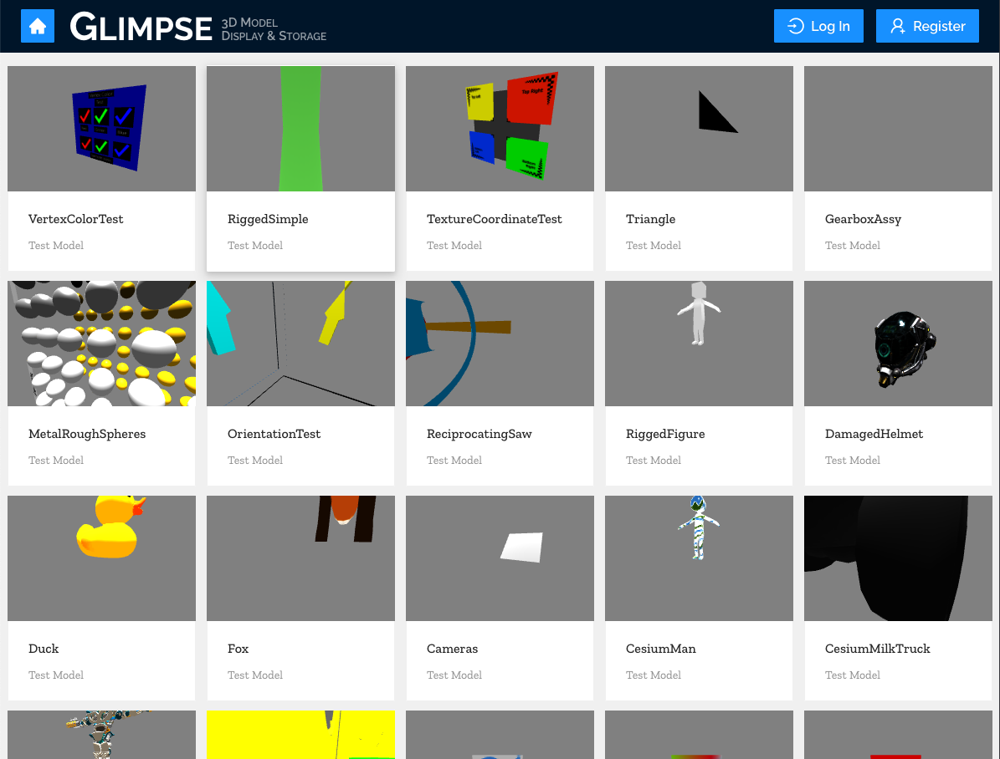
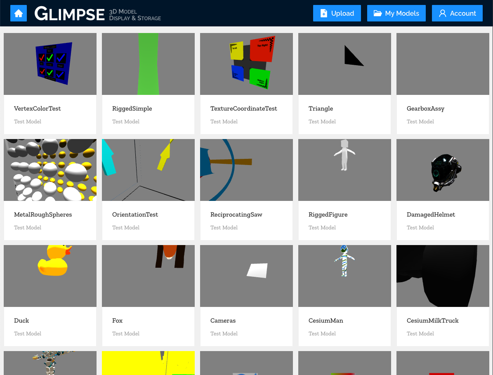

[Home](../../README.md) > [User Guides](../User-Guide.md) > Home Page Tour

# Home Page Tour

- View a large number of models uploaded by users
- Link to the account registration page
- Link to the user login page
- Log out of a currently logged in account
- Link to your account’s profile page

## Components

### Register Button

Click this button to be taken to the new account registration page. Only appears to users who are not logged in.

### Login Button

Click this button to be taken to the login page for existing users. Only appears to users who are not logged in.

### My Models Button

Click this button while logged into an account to be taken to your personal models list page. Only appears to users who are logged in.

### Account Button

Click this button to drop down a menu that allows you to log out or go to your account settings. Only appears to users who are logged in.

### Model Grid

A never ending grid of user uploaded models. Each panel shows a thumbnail of the model, the user who uploaded it, as well as the number of likes and comments. Each panel is interactable, and clicking on one will redirect to the 3D viewer page where the model can be interacted with more granularly. See the [3D viewer page for details](./Viewers.md).

## Images

### When Not Logged In

### When Logged In

### Account Menu Dropdown

## Features

## Walkthroughs

### Register for an account

[See the user accounts walkthrough](./User-Accounts.md#register).

### Log in

[See the user accounts walkthrough](./User-Accounts.md#log-in).

### Log out

[See the user accounts walkthrough](./User-Accounts.md#log-out).

### Upload a model

[See the model upload walkthrough](./Model-Upload.md#walkthrough).

### View a model

[See the model details walkthrough](./Model-Details.md#model-interaction).

### Download a model

[See the model download walkthrough](./Model-Details.md#download-a-model).
