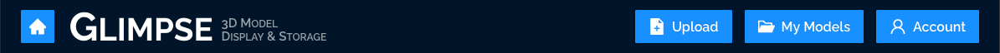

[Home](../../README.md) > [User Guides](./User-Guide.md) > Model Upload

# Model Upload

> Note: the Model Upload workflow is still under development, so not all information is available at present. As development continues, this guide will be updated to reflect changes and additions.

## Features

- Upload your models to Glimpse’s storage buckets
- Create a thumbnail for your model, or upload your own
- Give your model a name, description, labels, and more
- Keep your model private, or allow public access and/or use

## Components

- Click-&-Select or Drag-&-Drop Uploader
- 3D Viewer for previewing the uploaded model
- Model information form

## Walkthrough

1. Log in to Glimpse. See the [User Accounts guide for details](./User-Accounts.md#log-in).

2. Click on the “Upload” button in the header menu bar, as in the above image.
1. Click on the Upload box to select a model file to upload.

    - You can also drag a file from your computer onto the Upload box.
    - Only the following file formats are currently supported: .gltf, .stl, .fbx, .ply, .obj, and .usdz.

1. Once the model file has uploaded, you will have the option to preview it and capture a thumbnail or to upload your own.
1. After adding a thumbnail, fill in the following information about your model: name, description, labels, and privacy setting.

    - Labels, also called tags, are descriptors for your model that will help Glimpse categorize it and make it easier for other users with access to find it.

1. Click on the “Done” button to save your model and the information you’ve entered.
