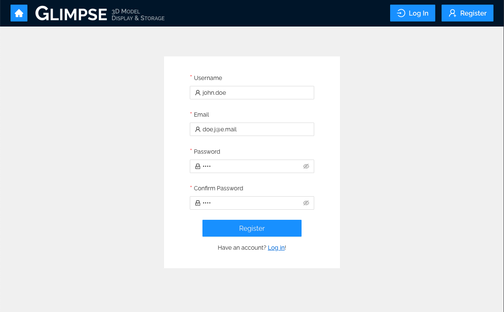
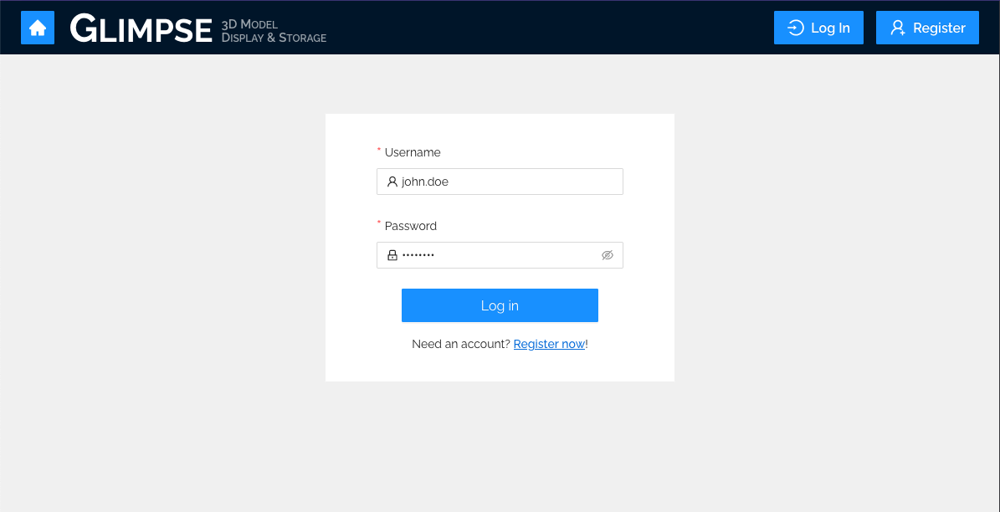
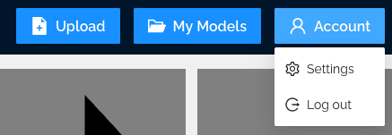

[Home](../../README.md) > [User Guides](./User-Guide.md) > User Accounts

# User Accounts

## Features

- View & download public models

- Upload & store your models

- Share your models publicly

## Walkthroughs

### Register

1. On any Glimpse page, click on the “Register” button in the header menu bar, as seen above. 
1. Enter a unique username. This will be the identifying name displayed publicly on your profile.
1. Enter an email address address you would like to link to your account.
1. Enter a strong password. Passwords should be at least 8 characters and contain a mixture of letters, numbers, and symbols.
1. Confirm password. Enter your password again to confirm it. Passwords must match to continue.
1. Click the form’s “Register” button!

### Log In

1. On any Glimpse page, click on the “Log In” button in the header menu bar, as seen above.
1. Enter the username associated with your personal account.
1. Enter your password.
1. Click the form’s “Log in” button!

### Log Out

1. Click on the “Account” button in the upper right corner of the page, as in the image above.
1. Click the “Log out” option in the menu that appears.
