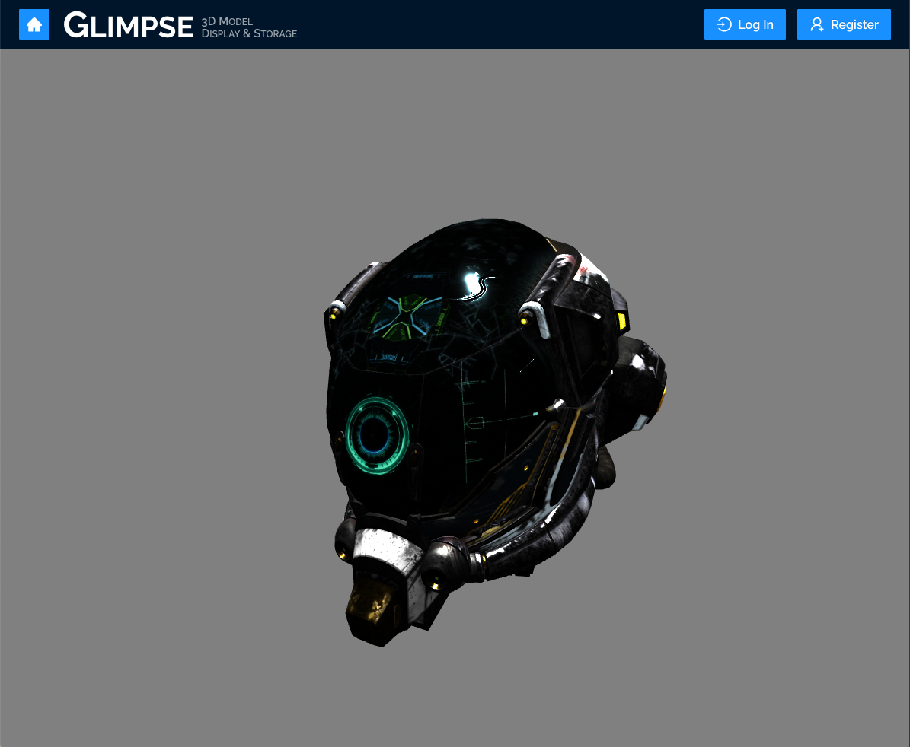
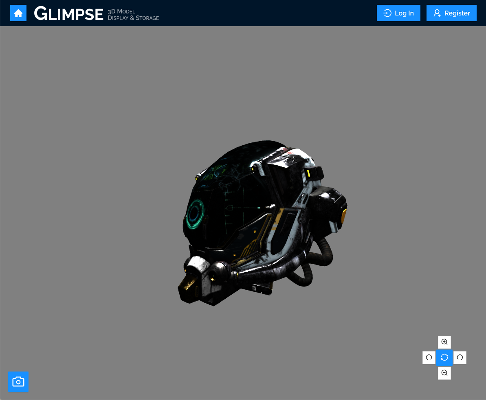

[Home](../../README.md) > [User Guides](../User-Guide.md) > 3D Viewers

# 3D Viewers

## Features

- Static and interactive viewers
- Ability to rotate and pan the camera, as well as zoom in and out
- Mouse- and keyboard-based controls, mimicked when possible by on-screen buttons
- Additional built-in tool to take and save pictures of models

## Components

### Static Viewer

The static viewer renders the 3D model as-is, and does not offer any controls or interaction with the model.

### Interactive Viewer

The interactive viewer renders the 3D model and provides various camera controls to the user.

### Interacting with a Model

> The buttons mentioned below can be seen in the image in the previous section.

| Action | Mouse/Keyboard | Matching Controls |
| -------- | ----------------------- | ------------------------ |
| Rotate | Mouse | Click and drag in the direction you want the model to rotate, or use the white buttons with the circular arrows to rotate left or right |
| Pan | Keyboard | Use the arrow keys to move the camera up, down, left, or right |
| Zoom In | Mouse | Scroll upwards, or click the white button showing a magnifying glass with a plus symbol |
| Zoom Out | Mouse | Scroll downwards, or click the white button showing a magnifying glass with a minus symbol |
| Reset Camera | Mouse | Click the blue button with two arrows going in a circle to reset the camera to the default position |
| Take picture | Mouse | Click on the blue button with the camera icon to take a picture of the current view |
